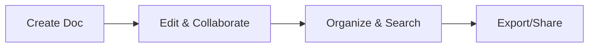

## Overview

Mekari provides powerful tools to streamline your documentation workflow. You create, collaborate, organize, and share knowledge efficiently. Key features include intuitive document creation, robust version control, advanced search capabilities, and flexible export options.

<Columns cols={3}>
  <Card title="Document Creation" icon="edit-3" href="#document-creation">
    Build rich documents with real-time editing.
  </Card>
  <Card title="Version Control" icon="git-branch" href="#version-control">
    Track changes and revert with ease.
  </Card>
  <Card title="Search & Organization" icon="search" href="#search-organization">
    Find and structure content quickly.
  </Card>
  <Card title="Export & Sharing" icon="share-2" href="#export-sharing">
    Distribute docs in multiple formats.
  </Card>
</Columns>

## Document Creation and Editing

Start new documents from templates or scratch. The editor supports markdown, rich text, and embeds.

<Steps>
  <Step title="Create Document" icon="plus">
    Navigate to your workspace and click `New Document`.

    Choose a template like `API Reference` or `User Guide`.
  </Step>
  <Step title="Edit Content" icon="edit">
    Use the toolbar for headings, lists, and code blocks.

````markdown
# Sample Heading

Add your content here.

```javascript
console.log("Hello, Mekari!");
```
````
  </Step>
  <Step title="Collaborate" icon="users">
    Invite team members via `@mention` or share links.
  </Step>
</Steps>

<Callout kind="tip">
  Enable real-time collaboration for instant feedback during edits.
</Callout>

## Version Control and History

Mekari tracks every change automatically. View diffs, restore versions, and compare edits.

<Tabs>
  <Tab title="View History" icon="clock">
    Click the history icon next to any document.

    Select a version to preview changes.
  </Tab>
  <Tab title="Restore Version" icon="refresh-cw">
    Right-click a version and select `Restore`.

    This creates a new version without overwriting current content.
  </Tab>
</Tabs>

<Expandable title="Advanced Version Compare" default-open="false">
  Use side-by-side diff views for `{added}`, `{removed}`, and `{modified}` lines.

  Export diffs as PDF for audits.
</Expandable>

## Search and Organization Tools

Powerful search finds content across your workspace. Organize with tags, folders, and collections.

| Feature          | Description                                      | Shortcut     |
|------------------|--------------------------------------------------|--------------|
| Global Search    | Search titles, content, and tags                 | `Cmd/Ctrl + K` |
| Tag Management   | Add/remove tags like `api`, `internal`           | Sidebar menu |
| Folders          | Nest documents hierarchically                     | Drag & drop  |
| Collections      | Curate public or private doc sets                | Dashboard    |

<Callout kind="info">
  Use advanced filters like `tag:api status:draft` for precise results.
</Callout>

## Export and Sharing Options

Publish docs publicly or privately. Export to PDF, HTML, or Markdown.

<CodeGroup tabs="Embed,PDF Export,Markdown">
  ```html
  <iframe src="https://docs.mekari.com/your-doc" width="100%" height="600"></iframe>
  ```
  ```bash
  curl -X POST https://api.mekari.com/export \
    -H "Authorization: Bearer YOUR_API_KEY" \
    -d '{"docId": "doc-123", "format": "pdf"}'
  ```
  ```markdown
  # Exported Document
  Content from Mekari...
  ```
</CodeGroup>

<Tabs>
  <Tab title="Public Sharing" icon="globe">
    Generate shareable links with permissions (view, edit).
  </Tab>
  <Tab title="Private Access" icon="lock">
    Restrict to workspace members or specific emails.
  </Tab>
</Tabs>



<Callout kind="success">
  Start with [Quickstart](/quickstart) to build your first document.
</Callout>